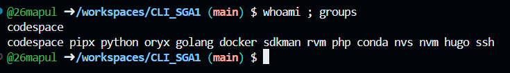
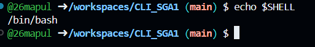
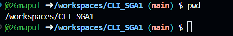
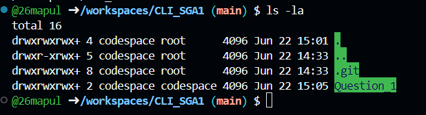
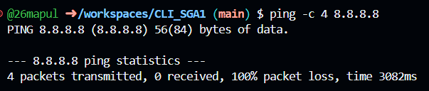

1. Username and Groups (whoami and groups)

The whoami command retrieves the active username of the current session, while groups lists all the security and permission groups assigned to this account. Observing these outputs is the critical first step for a support engineer to verify their identity and ensure they have the necessary administrative access privileges before interacting with company resources.

2. Current Shell (echo $SHELL)

Printing the $SHELL environment variable reveals the absolute path to the command-line interpreter currently in use (such as /bin/bash). This observation is essential because different shells have varying syntax and built-in commands. Confirming the environment ensures that any subsequent system scripts will execute correctly without compatibility errors.

3. Current Working Directory (pwd)

The pwd (print working directory) command outputs the absolute, full path of the current directory starting from the root (/). Executing this provides spatial awareness within the Linux file system hierarchy. It is a necessary safety check to guarantee that subsequent file manipulations or script executions occur in the intended workspace, preventing accidental data loss.

4. Workspace Files (ls -la)

Using ls -la lists all directory contents, including hidden system files that start with a dot. The -l flag provides a detailed, long-format view showing file permissions (read/write/execute), ownership, size, and modification dates. This allows the engineer to verify that necessary lab files are present and that they possess the correct access rights to modify them.

5. Network Connectivity (ping -c 4 8.8.8.8)

The ping command tests outward network connectivity by sending ICMP echo request packets to a remote server (in this case, Google's public DNS). The -c 4 flag restricts the test to exactly four packets to prevent an infinite loop. Observing a 0% packet loss in the output confirms that the machine's network interface is active and successfully routing traffic to the internet.
