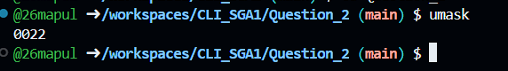
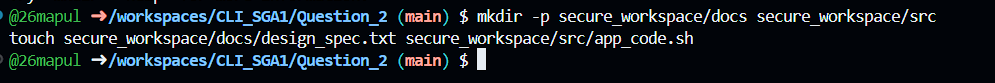
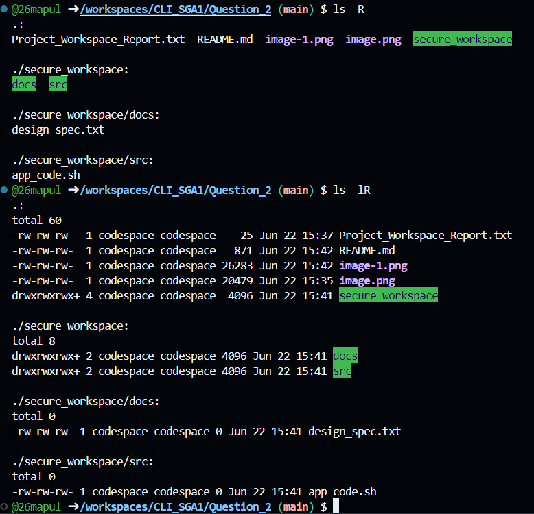
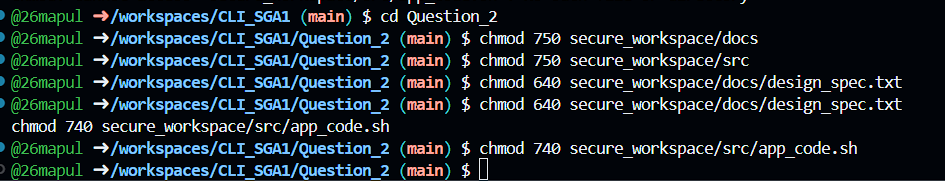
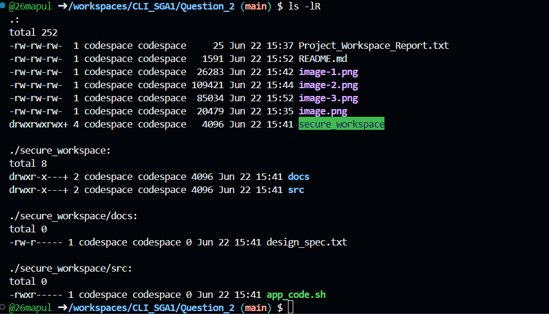

1. Observations on Umask and Initial Permissions

The umask command returned a default value (typically 0022 or 0002 in cloud environments), which automatically strips certain permissions when new files are created. Because of this, the initial ls -lR output showed that newly created directories defaulted to 755 (read/write/execute for owner, read/execute for others) and files defaulted to 644 (read/write for owner, read-only for others). This is a standard baseline but is too permissive for a strictly "secure" project workspace, necessitating manual permission adjustments.

2. mkdir -p and touch

Used mkdir -p to instantly create the nested workspace directories, followed by touch to generate the empty project files. This successfully established the required baseline directory structure for the project team.

3. ls -R and ls -lR (Before Modification)

Ran ls -lR to recursively display the detailed permissions of the newly created workspace. I observed that the default permissions (like 755 for folders and 644 for files) allow unauthorized users to read the contents, which is unsafe for sensitive project data.

4. chmod 750, 640, and 740 (Modifying Permissions)

Executed a series of chmod commands using octal values to explicitly restrict access based on the principle of least privilege. This secures the data by giving the owner full control, giving the group limited read/execute access, and completely locking out all other users (setting their permission bit to 0).

5. ls -lR (After Modification)

Executed ls -lR a final time to verify that the new permissions were successfully applied. I observed that the permissions string now reflects the strict access controls, confirming the workspace is properly secured.

Explanation of How Permissions Protect Project Data:

The modified permissions (750 for directories, 640 for files, and 740 for scripts) protect project data by strictly enforcing the Principle of Least Privilege.

Owner (User): Retains full control to read, modify, and execute files, ensuring the creator can actually work on the project.

Group: Team members are granted limited access. They can read documentation and execute scripts, but the write (w) permission is removed. This prevents colleagues from accidentally overwriting, altering, or deleting critical project data.

Others: Unaffiliated users have all permissions revoked (0). This creates a hard security boundary, ensuring that external users on the same server cannot even see the directory contents, effectively making sensitive project data invisible and inaccessible to unauthorized parties.