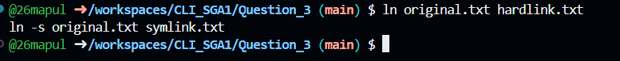
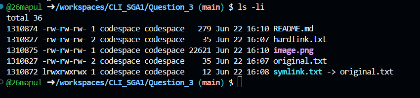
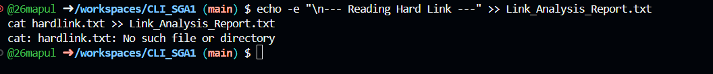

1. ln and ln -s (Creating Links)

Executed ln to create a hard link, which points directly to the data blocks on the hard drive. Then executed ln -s to create a symbolic link, which acts merely as a shortcut pointing to the filename of the original file.

2. ls -li (Observing Inodes Before Deletion)

Used ls -li to view the inode (Index Node) numbers. I observed that the original file and the hard link share the exact same inode number, proving they are just two different names for the exact same physical data. The symbolic link has a completely different inode number and a smaller file size, as it only stores the path string.

3. rm original.txt (Deleting the Target)

Deleted the original file to test the resilience of both link types when their source filename is removed.

4. cat (Investigating Behavior After Deletion)

Attempted to output the contents of both links. I observed that the hard link still successfully displayed the text; the data remains on the disk because the hard link still points to that inode. Conversely, attempting to read the symbolic link resulted in a "No such file or directory" error because it was pointing to a filename that no longer exists, leaving it "broken" or "dangling."

Conclusions Drawn from the Experiment:

Based on this experiment, the core difference between hard links and symbolic (soft) links lies in how they reference data on the file system:

1. Hard Links act as additional names for the exact same physical data. Because the original file and the hard link share the identical inode number, they are functionally equal. Deleting the original filename does not destroy the actual data on the disk, because the hard link still maintains a direct connection to that inode.

2. Symbolic Links act merely as shortcuts to a specific file path. The symbolic link possesses its own unique inode and only stores the text path pointing to the original file. Consequently, when the original target file is deleted, the path becomes invalid, leaving the symbolic link "broken" or "dangling" and unable to access the data.
