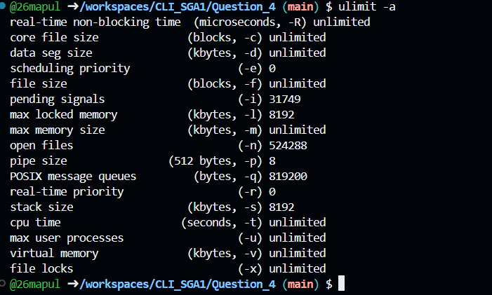
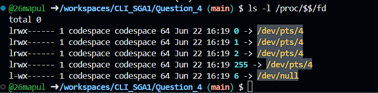
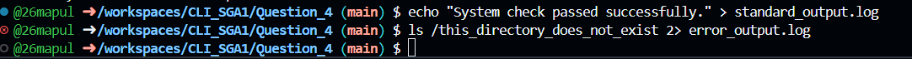

1. Resource Limits (ulimit -a)

Executed ulimit -a to view the resource restrictions placed on the current shell session. I observed the "open files" limit (typically 1024), which is critical information when investigating logging issues to ensure the application hasn't hit its maximum allowed file connections.

2. Open Files & Descriptors (ls -l /proc/$$/fd)

Listed the contents of /proc/$$/fd to view the active file descriptors for the current terminal process. I observed the default descriptors 0 (stdin), 1 (stdout), and 2 (stderr) pointing directly to the pseudo-terminal device (/dev/pts), proving that the shell's input and output streams are actively open.

3. Output and Error Redirection (> and 2>)

Used the > operator to successfully redirect standard output into a log file, and the 2> operator to capture a deliberate system error into a separate log file. This experiment demonstrates how a support engineer can isolate normal application logs from critical error streams without cluttering the main console.

Resource Limits Observed:

By executing the ulimit -a command, I observed the system-enforced resource limits for the current shell session, specifically noting the "open files" limit (which typically defaults to 1024). In the context of investigating application logging issues, verifying this specific limit is critical; if an application attempts to open more files or network connections than this limit allows, the system will block the I/O operation, resulting in blocked logs and application crashes.

4. Explanation of How Linux Manages File I/O

Linux manages file I/O by adhering to the principle that "everything is a file," assigning a unique, non-negative integer called a File Descriptor (FD) to every open file, socket, or device. The operating system kernel maintains a file table that maps these descriptors (starting with 0, 1, and 2 for standard streams) to the physical inodes on the disk. This architecture allows the system to seamlessly route data streams, manage concurrent access, and enforce resource limits universally across all applications