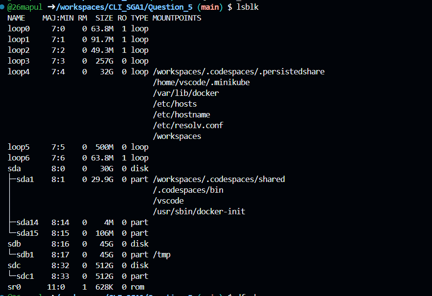
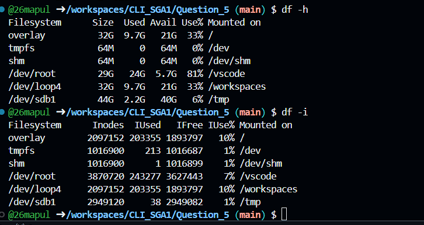
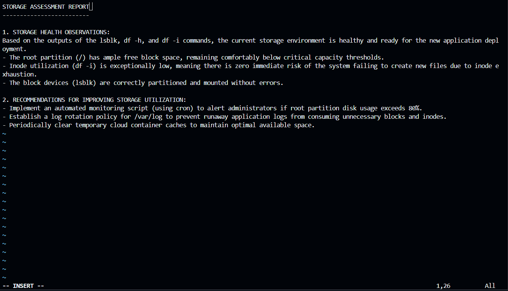

#Explanation:

lsblk: Executed to list all available block storage devices and their partition tree, confirming the physical layout of the drives.

df -h: Used to display mounted file systems and their current disk usage in a human-readable format (Megabytes/Gigabytes), ensuring there is enough block space for the new application.

df -i: Executed to check inode utilization, verifying that the system has enough index nodes available to handle the creation of new application files and logs.

vi: Utilized the visual editor to document the findings, practicing command-line text manipulation and file creation without a graphical user interface.

1. 

2. 

3. 
